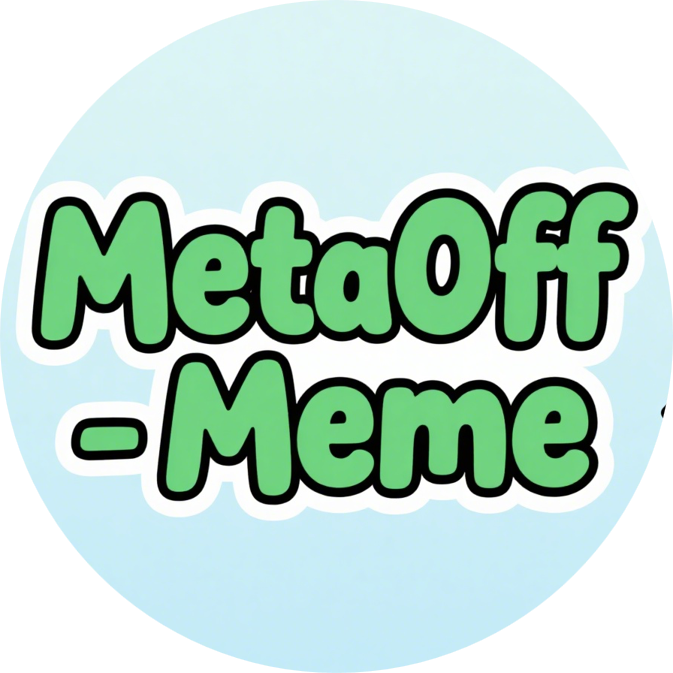
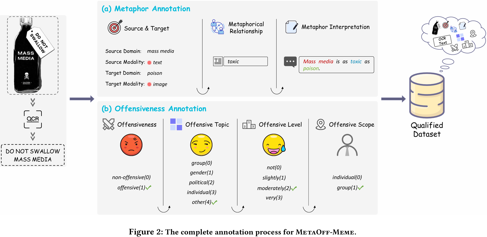

    <h1 align="center">
        
        <b><em>MetaOff-Meme: A Metaphor-Enriched Benchmark for Meme Offensiveness Detection</em></b>
    </h1>
    
    
    
 

we construct a meme offensiveness detection dataset, MetaOff-Meme, with metaphorical annotations, providing valuable resources for advancing research in this field.

The dataset labels are in the file `data/data.json` directory.

The appendix of the paper is located in `paper/MetaOff_Appendix.pdf`.

For the image dataset, please click [here](https://drive.google.com/file/d/1R4pAiawNSOJnPBPe9_BSnJJlWc1O_gy2/view?usp=sharing).

🚨***Disclaimer: The examples provided in this article may be disturbing.***

## 🌟Introduction to MetaOff-meme

  

### (1): Offensiveness Annotation:

> > 1.Offensiveness:	non-offensive(0);	offensive(1)
> >
> > 2.Offensive Topic:	Group(0);	Gender(1);	Political(2);	Individual(3);	Other(4)
> >
> > 3.Offensive Level:	Not(0);	Slightly(1);	Moderately(2);	Very(3)	
> >
> > 4.Offensive Scope:	Individual(0);	Group(1)

### (2):Metaphor Annotation: 

> > 1.source domain, target domain: 	the relevant description of things.
> >
> > 2.source modality, target modality : text(0);	image(1);	complementary(2)
> >
> > 3.metaphor relation: 	attribute description of the comparison between the source domain and the target domain
> >
> > 4.metaphor overall explanation
> >
> > **Note that some metaphoric relationships in memes may have two instances. Therefore, we add subscripts _1 and _2 to different metaphors to distinguish their corresponding relationships.**

## ❗Ethics Statement

We believe that the benefits of the provided resources outweigh the associated risks and that their use can contribute meaningfully to scientific advancements.  All resources are intended solely for scientific research purposes and are strictly prohibited from commercial use.  Users are expected to adhere to ethical guidelines and applicable regulations when utilizing the dataset.

## 📄 License

  **Usage and License Notices**: The data and code are intended and licensed for research use only.
License: Attribution-NonCommercial 4.0 International It should abide by the policy of OpenAI: https://openai.com/policies/terms-of-use
